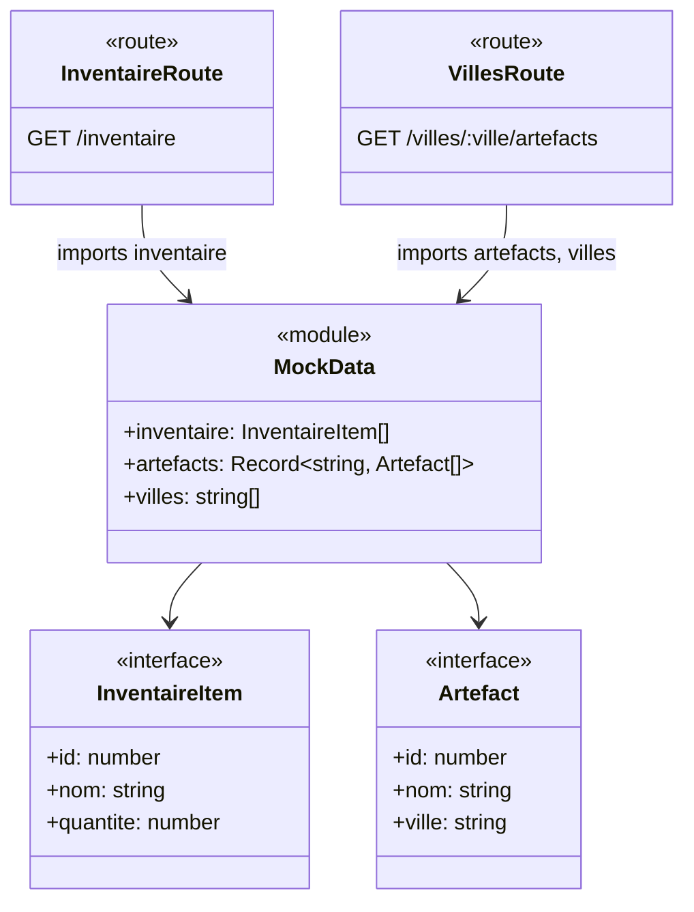

# C4 Code Level: API Data Module

## Overview

- **Name**: Valdoria Reserve Mock Data Layer
- **Description**: In-memory mock data module providing inventory and artifact data structures for the Réserve de Valdoria API
- **Location**: `packages/api/src/data/`
- **Language**: TypeScript
- **Purpose**: Central data repository supplying mock inventory items and artifacts organized by city, used throughout the API routes for RBAC and ABAC authorization demonstrations

## Code Elements

### Interfaces

#### `InventaireItem`
- **Location**: `packages/api/src/data/mock.ts:5-9`
- **Properties**:
  - `id: number` — Unique identifier
  - `nom: string` — Item name (e.g., "Épée de Valdoria")
  - `quantite: number` — Available quantity

#### `Artefact`
- **Location**: `packages/api/src/data/mock.ts:11-15`
- **Properties**:
  - `id: number` — Unique identifier
  - `nom: string` — Artifact name (e.g., "Couronne impériale")
  - `ville: string` — City key (e.g., "valdoria-centre", "nordheim")

### Data Exports

#### `inventaire: InventaireItem[]`
- **Location**: `packages/api/src/data/mock.ts:21-27`
- **Content**: 5 inventory items (weapons, shields, potions, scrolls, gems)
- **Access Control**: Requires `marchand` role (RBAC)
- **Used by**: `packages/api/src/routes/inventaire.ts`

#### `artefacts: Record<string, Artefact[]>`
- **Location**: `packages/api/src/data/mock.ts:34-50`
- **Content**: 3 cities × 3 artifacts = 9 total
  - `"valdoria-centre"`: Imperial items (Couronne impériale, Sceptre royal, Sceau de l'empereur)
  - `"nordheim"`: Nordic items (Hache nordique, Fourrure d'ours, Cor de guerre)
  - `"sudbourg"`: Southern items (Amphore antique, Mosaïque dorée, Statue de marbre)
- **Access Control**: RBAC (`marchand`) + ABAC (`villeOrigine` attribute match; `gouverneur` bypasses)
- **Used by**: `packages/api/src/routes/villes.ts`

#### `villes: string[]`
- **Location**: `packages/api/src/data/mock.ts:55`
- **Derivation**: `Object.keys(artefacts)` → `["valdoria-centre", "nordheim", "sudbourg"]`
- **Used by**: `packages/api/src/routes/villes.ts` (validation + 404 response)

## Dependencies

### Internal
- Consumed by `routes/inventaire.ts` and `routes/villes.ts`

### External
- TypeScript type system only; no runtime dependencies

## Relationships

