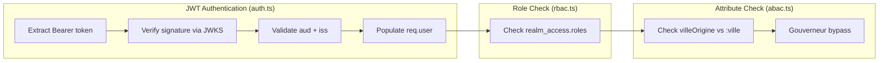

# C4 Code Level: API Middleware Layer

## Overview

- **Name**: Express Middleware for Authentication & Authorization
- **Description**: JWT authentication via Keycloak, role-based access control (RBAC), and attribute-based access control (ABAC) middleware for the Réserve de Valdoria API
- **Location**: `packages/api/src/middleware/`
- **Language**: TypeScript
- **Purpose**: Secure API endpoints by validating JWT tokens from Keycloak, enforcing role-based permissions, and restricting resource access based on user attributes

## Code Elements

### Types

#### `KeycloakToken` (Interface)
- **Location**: `packages/api/src/middleware/auth.ts:39-50`
- **Properties**:
  - `sub: string` — User unique identifier
  - `email?: string` — User email
  - `preferred_username?: string` — Display username
  - `realm_access?: { roles: string[] }` — Realm roles array
  - `villeOrigine?: string` — Custom attribute: city of origin
  - `aud?: string | string[]` — Audience claim
  - `iss?: string` — Issuer claim
  - `exp?: number` — Expiration timestamp

### Functions

#### `authenticateJWT(req, res, next): void`
- **Location**: `packages/api/src/middleware/auth.ts:68-122`
- **Description**: Validates JWT tokens from `Authorization: Bearer <token>` header. Verifies signature via JWKS, audience (`reserve-valdoria`), and issuer (`valdoria` realm). Populates `req.user` with decoded payload.
- **Error Responses**:
  - 401: Missing/invalid/expired token
- **Dependencies**: `jsonwebtoken`, `jwks-rsa`, `config.getJwksUri()`, `config.getIssuer()`

#### `getKey(header, callback): void` (internal)
- **Location**: `packages/api/src/middleware/auth.ts:19-28`
- **Description**: JWKS callback for `jwt.verify()`. Fetches signing key from Keycloak's JWKS endpoint with 10-minute caching.
- **Dependencies**: `jwks-rsa` client instance

#### `requireRole(...roles): Middleware`
- **Location**: `packages/api/src/middleware/rbac.ts:9-41`
- **Signature**: `requireRole(...roles: string[]) => (req, res, next) => void`
- **Description**: Higher-order function returning RBAC middleware. Checks `realm_access.roles` for at least one matching role. Supports composite roles (e.g., `gouverneur` inheriting `marchand`).
- **Error Responses**:
  - 401: Missing `req.user`
  - 403: User lacks required role

#### `requireVilleAccess(req, res, next): void`
- **Location**: `packages/api/src/middleware/abac.ts:8-62`
- **Description**: ABAC middleware comparing user's `villeOrigine` token attribute with `req.params.ville`. Users with `gouverneur` role bypass the check.
- **Error Responses**:
  - 401: Missing `req.user`
  - 403: Missing `villeOrigine` attribute or city mismatch

## Dependencies

### Internal
| Dependency | Source | Purpose |
|-----------|--------|---------|
| `config` | `../config.js` | Keycloak client ID |
| `getJwksUri()` | `../config.js` | JWKS endpoint URL |
| `getIssuer()` | `../config.js` | Expected issuer URL |
| `KeycloakToken` | `auth.ts` | Shared type (used by rbac.ts, abac.ts) |

### External
| Package | Purpose |
|---------|---------|
| `express` | Request/Response/NextFunction types |
| `jsonwebtoken` | JWT signature verification |
| `jwks-rsa` | JWKS key retrieval with caching |

## Relationships



### Middleware Execution Order

```
HTTP Request
  → [1] authenticateJWT (required first)
  → [2] requireRole (optional RBAC)
  → [3] requireVilleAccess (optional ABAC)
  → [4] Route Handler
```
