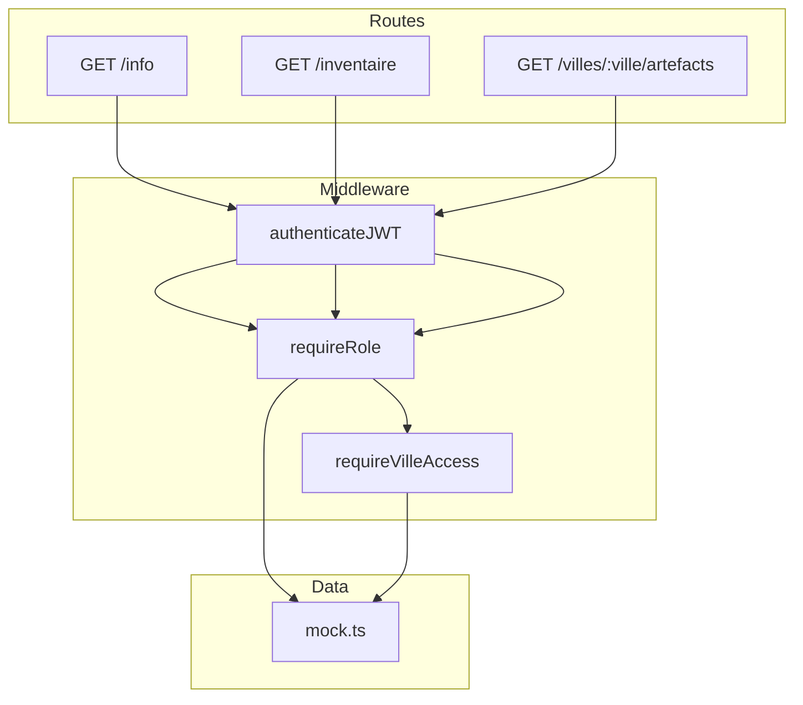

# C4 Code Level: API Routes Layer

## Overview

- **Name**: API Routes (packages/api/src/routes)
- **Description**: Express route handlers implementing REST endpoints with JWT authentication, RBAC, and ABAC authorization
- **Location**: `packages/api/src/routes/`
- **Language**: TypeScript
- **Purpose**: Define HTTP route handlers integrating Keycloak authentication/authorization with Express.js

## Code Elements

### Public Routes (`public.ts`)

#### `GET /info`
- **Location**: `packages/api/src/routes/public.ts:12-18`
- **Middleware**: `authenticateJWT` → `requireRole("sujet")`
- **Response**: `{ nom, id, description }` — API identification
- **Status Codes**: 200, 401, 403

### Inventory Routes (`inventaire.ts`)

#### `GET /inventaire`
- **Location**: `packages/api/src/routes/inventaire.ts:15-25`
- **Middleware**: `authenticateJWT` → `requireRole("marchand")`
- **Response**: `{ inventaire: InventaireItem[], total: number }`
- **Status Codes**: 200, 401, 403
- **Access**: `marchand` role (direct) or `gouverneur` (composite inheritance)

### Cities Routes (`villes.ts`)

#### `GET /villes/:ville/artefacts`
- **Location**: `packages/api/src/routes/villes.ts:17-45`
- **Middleware**: `authenticateJWT` → `requireRole("marchand")` → `requireVilleAccess`
- **Parameters**: `:ville` (string, case-insensitive)
- **Response (200)**: `{ ville, artefacts: Artefact[], total }`
- **Response (404)**: `{ error, message, villes_disponibles: string[] }`
- **Status Codes**: 200, 401, 403, 404
- **Access**: RBAC (`marchand`) + ABAC (`villeOrigine` must match; `gouverneur` bypasses)

## Authorization Matrix

| Route | Method | Required Role | RBAC | ABAC | Notes |
|-------|--------|---------------|------|------|-------|
| `/info` | GET | `sujet` | Yes | No | Public for all authenticated users |
| `/inventaire` | GET | `marchand` | Yes | No | `gouverneur` inherits `marchand` |
| `/villes/:ville/artefacts` | GET | `marchand` | Yes | Yes | `gouverneur` bypasses ABAC |

## Dependencies

### Internal
- `authenticateJWT` from `../middleware/auth.ts`
- `requireRole` from `../middleware/rbac.ts`
- `requireVilleAccess` from `../middleware/abac.ts`
- `inventaire`, `artefacts`, `villes` from `../data/mock.ts`

### External
- `express` (Router, Request, Response types)

## Relationships

