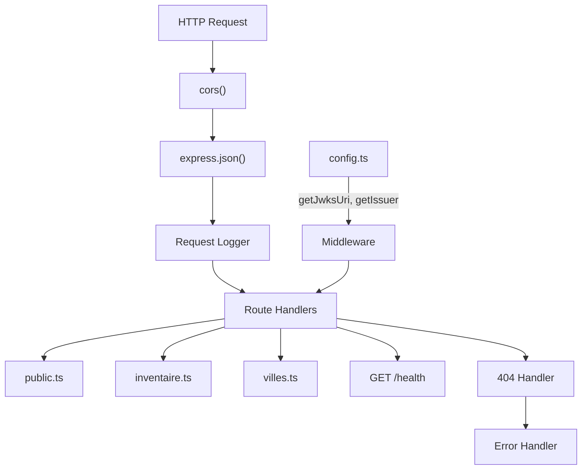

# C4 Code Level: API Entry Point & Configuration

## Overview

- **Name**: Réserve de Valdoria API — Root Entry Point
- **Description**: Express server initialization, middleware configuration, route mounting, and Keycloak configuration
- **Location**: `packages/api/src/`
- **Language**: TypeScript
- **Purpose**: Express application entry point with CORS, logging, route registration, health checks, and Keycloak configuration management

## Code Elements

### Configuration Module (`config.ts`)

#### `config` Object
- **Location**: `packages/api/src/config.ts:8-16`
- **Properties**:
  - `port: number | string` — Server port (default: 3001)
  - `keycloak.url: string` — Keycloak URL (default: `http://localhost:8080`)
  - `keycloak.issuerUrl: string` — Issuer URL (defaults to `keycloak.url`)
  - `keycloak.realm: string` — Realm name (default: `valdoria`)
  - `keycloak.clientId: string` — Client ID (default: `reserve-valdoria`)
- **Source**: Environment variables via `dotenv`

#### `getJwksUri(): string`
- **Location**: `packages/api/src/config.ts:21-23`
- **Returns**: `{keycloak.url}/realms/{realm}/protocol/openid-connect/certs`

#### `getIssuer(): string`
- **Location**: `packages/api/src/config.ts:28-30`
- **Returns**: `{issuerUrl}/realms/{realm}`

### Server Module (`index.ts`)

#### Express Application
- **Location**: `packages/api/src/index.ts:8`
- **Middleware Stack**:
  1. `cors()` — Cross-origin support
  2. `express.json()` — JSON body parser
  3. Request logger (lines 15-18) — Logs `[timestamp] METHOD PATH`
  4. Route modules: `publicRoutes`, `inventaireRoutes`, `villesRoutes` — mounted at `/`
  5. `GET /health` (lines 26-28) — Returns `{ status: "ok", timestamp }`
  6. 404 handler (lines 31-36) — `{ error: "Not Found", message }`
  7. Error handler (lines 39-45) — `{ error: "Internal Server Error", message }`

## Dependencies

### Internal
- `./routes/public.js` — Public routes (mounted at `/`)
- `./routes/inventaire.js` — Inventory routes (mounted at `/`)
- `./routes/villes.js` — Cities routes (mounted at `/`)

### External
| Package | Version | Purpose |
|---------|---------|---------|
| `express` | ^5.2.1 | Web framework |
| `cors` | ^2.8.6 | CORS middleware |
| `dotenv` | ^17.3.1 | Environment variable loading |
| `jsonwebtoken` | ^9.0.3 | JWT verification |
| `jwks-rsa` | ^3.2.2 | JWKS key retrieval |

### External Services
- **Keycloak** — OIDC provider for JWT validation

## Relationships

