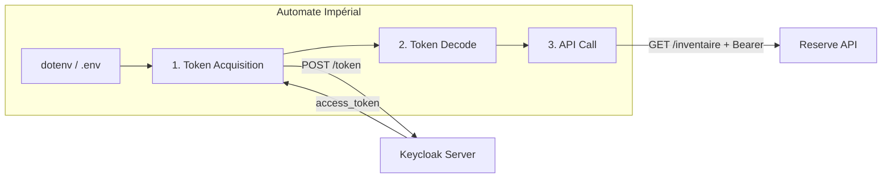

# C4 Code Level: CLI — Automate Impérial

## Overview

- **Name**: Automate Impérial CLI
- **Description**: Machine-to-machine (M2M) script implementing OAuth 2.0 Client Credentials flow to obtain tokens from Keycloak, decode JWT payload, and call protected API endpoints
- **Location**: `packages/cli/src/`
- **Language**: TypeScript (ES2022)
- **Purpose**: Demonstrate server-to-server authentication using Client Credentials flow for the formation

## Code Elements

### Configuration Constants
- **Location**: `packages/cli/src/index.ts:1-7`

| Constant | Default | Source |
|----------|---------|--------|
| `KEYCLOAK_URL` | `http://localhost:8080` | `process.env` |
| `KEYCLOAK_REALM` | `valdoria` | `process.env` |
| `CLIENT_ID` | `automate-imperial` | `process.env` |
| `CLIENT_SECRET` | `""` | `process.env` |
| `API_URL` | `http://localhost:3001` | `process.env` |

### Phase 1: Token Acquisition
- **Location**: `packages/cli/src/index.ts:9-35`
- POST to `{KEYCLOAK_URL}/realms/{REALM}/protocol/openid-connect/token`
- Body: `grant_type=client_credentials`, `client_id`, `client_secret`
- Extracts `access_token` from response
- Exits with code 1 on failure

### Phase 2: Token Decoding
- **Location**: `packages/cli/src/index.ts:37-52`
- Splits JWT on `.`, decodes middle segment (base64url → UTF-8)
- Logs: `sub`, `azp`, realm roles, expiration
- **Note**: No signature verification (educational only)

### Phase 3: Authenticated API Call
- **Location**: `packages/cli/src/index.ts:54-71`
- GET `{API_URL}/inventaire` with `Authorization: Bearer {token}`
- Logs status code and JSON response

## Dependencies

### External
- **dotenv** (^17.3.1) — Environment variable loading
- **Node.js built-ins**: `fetch`, `Buffer`, `URLSearchParams`, `process`

### External Services
- **Keycloak Server** — Token endpoint (Client Credentials grant)
- **Reserve API** — `GET /inventaire` (protected endpoint)

## Relationships

