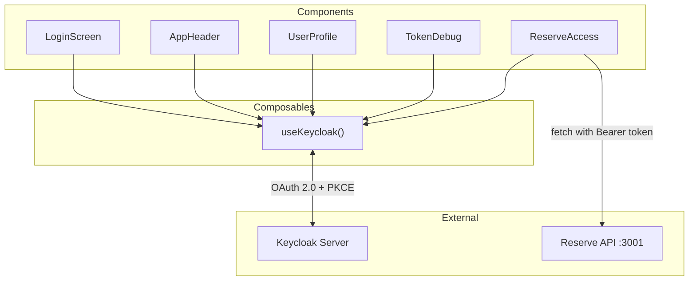

# C4 Code Level: Front-End Vue 3 Components

## Overview

- **Name**: Comptoir des Voyageurs — Vue 3 Components
- **Description**: Core UI components providing authentication, user profile display, token debugging, and API testing
- **Location**: `packages/front/src/components/`
- **Language**: TypeScript + Vue 3 (Composition API with `<script setup>`)
- **Purpose**: User interface layer for the Keycloak-secured SPA with fantasy-themed styling

## Code Elements

### AppHeader.vue
- **Location**: `packages/front/src/components/AppHeader.vue:1-151`
- **Description**: Navigation header with route buttons (Reserve, Profil, Debug), current username, and logout button
- **Composables**: `useKeycloak()` → `userProfile`, `logout()`
- **Router**: `useRouter()` for `navigateTo(name)`, `useRoute()` for `isActive(name)`

### LoginScreen.vue
- **Location**: `packages/front/src/components/LoginScreen.vue:1-82`
- **Description**: Full-page authentication screen displayed before login. "Entrer dans le Comptoir" button triggers `useKeycloak().login()`

### UserProfile.vue
- **Location**: `packages/front/src/components/UserProfile.vue:1-129`
- **Description**: Displays user identity (username, email, names), roles ("Titres impériaux" as badges), and custom Keycloak attributes
- **Data source**: `useKeycloak().userProfile`

### TokenDebug.vue
- **Location**: `packages/front/src/components/TokenDebug.vue:1-219`
- **Description**: Developer tool displaying all three JWT tokens (access, ID, refresh) with collapsible raw/parsed views. Shows key claims (aud, sub, roles, exp).
- **State**: `expandedSections: Ref<{ accessToken, idToken, refreshToken }>` for toggle
- **Methods**: `toggleSection(section)`, `formatJson(obj)`
- **Data source**: `useKeycloak()` → `token`, `idToken`, `refreshToken`, `parsedToken`, `parsedIdToken`

### ReserveAccess.vue
- **Location**: `packages/front/src/components/ReserveAccess.vue:1-471`
- **Description**: API endpoint testing interface for three authorization levels:
  - `/info` — RBAC (`sujet`)
  - `/inventaire` — RBAC (`marchand`)
  - `/villes/:ville/artefacts` — RBAC + ABAC
- **State**: `infoResponse`, `inventaireResponse`, `artefactsResponse` (ApiResponse refs), `villeTest` (selected city)
- **Methods**: `callApi(endpoint, responseRef, useAuth)`, `testInfo()`, `testInventaire()`, `testArtefacts()`, `getStatusClass()`, `getStatusBadge()`
- **Data source**: `useKeycloak()` → `token`, `userProfile`; `API_URL` from config

## Dependencies

### Internal
- `useKeycloak()` from `../composables/useKeycloak.ts` — all components
- `API_URL` from `../config.ts` — ReserveAccess only
- Vue Router routes: `Reserve`, `Profil`, `Debug` — AppHeader navigation

### External
- **Vue 3** (`ref`, `<script setup>`, directives)
- **vue-router** (`useRouter`, `useRoute`)
- **keycloak-js** (indirectly via composable)

## Relationships

