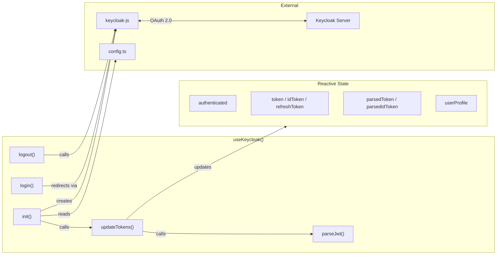

# C4 Code Level: Vue 3 Keycloak Composable

## Overview

- **Name**: Keycloak Authentication Composable
- **Description**: Vue 3 composable providing singleton-based Keycloak authentication management — OAuth 2.0/OIDC flows, token management, user profile extraction, and session synchronization
- **Location**: `packages/front/src/composables/`
- **Language**: TypeScript (Vue 3)
- **Purpose**: Centralize Keycloak authentication logic into a reusable reactive composable for the SPA

## Code Elements

### Interfaces

#### `ParsedToken`
- **Location**: `useKeycloak.ts:9-22`
- **Properties**: `sub?, aud?, exp?, iat?, realm_access?: { roles: string[] }, email?, preferred_username?, given_name?, family_name?, [key: string]: unknown`

#### `UserProfile`
- **Location**: `useKeycloak.ts:25-32`
- **Properties**: `username?, email?, firstName?, lastName?, roles: string[], attributes: Record<string, unknown>`

### Module-Level Reactive State

| Variable | Type | Location | Initial |
|----------|------|----------|---------|
| `keycloakInstance` | `Keycloak \| null` | :38 | `null` |
| `authenticated` | `Ref<boolean>` | :44 | `false` |
| `token` | `Ref<string \| undefined>` | :45 | `undefined` |
| `idToken` | `Ref<string \| undefined>` | :46 | `undefined` |
| `refreshToken` | `Ref<string \| undefined>` | :47 | `undefined` |
| `parsedToken` | `Ref<ParsedToken \| undefined>` | :48 | `undefined` |
| `parsedIdToken` | `Ref<ParsedToken \| undefined>` | :49 | `undefined` |
| `userProfile` | `Ref<UserProfile>` | :50-53 | `{ roles: [], attributes: {} }` |

### Functions

#### `parseJwt(token: string): ParsedToken | undefined`
- **Location**: `useKeycloak.ts:60-76`
- **Description**: Decodes JWT payload (base64url → JSON). No signature verification (client-side inspection only).

#### `updateTokens(): void`
- **Location**: `useKeycloak.ts:80-122`
- **Description**: Syncs Vue reactive state with keycloak-js tokens. Parses tokens, extracts user profile, filters standard OIDC claims from custom attributes.

#### `init(): Promise<void>`
- **Location**: `useKeycloak.ts:127-181`
- **Description**: Creates Keycloak singleton, initializes with `check-sso` strategy (silent SSO check), sets up 30-second token refresh interval.
- **Configuration**: `onLoad: 'check-sso'`, `checkLoginIframe: false`, `redirectUri: /callback`

#### `login(): void`
- **Location**: `useKeycloak.ts:188-192`
- **Description**: Triggers Authorization Code + PKCE flow, redirects to `/callback`.

#### `logout(): void`
- **Location**: `useKeycloak.ts:197-199`
- **Description**: Invalidates session on Keycloak server (Single Sign-Out). `onAuthLogout` callback clears all state.

### Composable Export

#### `useKeycloak()`
- **Location**: `useKeycloak.ts:204-217`
- **Returns** (all refs readonly):
  - `authenticated`, `token`, `idToken`, `refreshToken`
  - `parsedToken`, `parsedIdToken`, `userProfile`
  - `init()`, `login()`, `logout()`

## Dependencies

### Internal
- `KEYCLOAK_URL`, `KEYCLOAK_REALM`, `KEYCLOAK_CLIENT_ID` from `../config`

### External
- **Vue 3** (`ref`, `Ref`)
- **keycloak-js** — OAuth 2.0/OIDC adapter (Authorization Code + PKCE)

## Relationships

