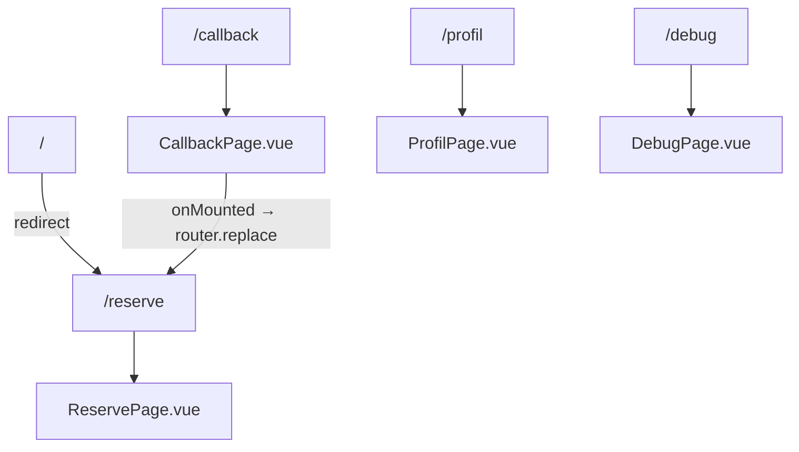

# C4 Code Level: Vue Router Configuration

## Overview

- **Name**: Vue Router Configuration
- **Description**: Route definitions mapping URL paths to Vue view components
- **Location**: `packages/front/src/router/index.ts`
- **Language**: TypeScript
- **Purpose**: Application navigation structure for the SPA

## Code Elements

### Router Instance
- **Location**: `packages/front/src/router/index.ts:34-37`
- **History Mode**: `createWebHistory()` — HTML5 history (clean URLs, no hash)
- **Export**: Default export used in `main.ts`

### Route Definitions

| Path | Name | Component | Purpose |
|------|------|-----------|---------|
| `/` | — | redirect → `/reserve` | App root redirect |
| `/callback` | `Callback` | `CallbackPage.vue` | OAuth 2.0 callback |
| `/reserve` | `Reserve` | `ReservePage.vue` | API endpoint testing |
| `/profil` | `Profil` | `ProfilPage.vue` | User profile display |
| `/debug` | `Debug` | `DebugPage.vue` | JWT token inspection |

## Dependencies

### Internal
- View components: `CallbackPage`, `ReservePage`, `ProfilPage`, `DebugPage`

### External
- **vue-router** (`createRouter`, `createWebHistory`, `RouteRecordRaw`)

## Notes

- No route guards: authentication is managed by `useKeycloak` composable, not at router level
- Server (nginx) must serve `index.html` for all routes (SPA fallback)

## Relationships

