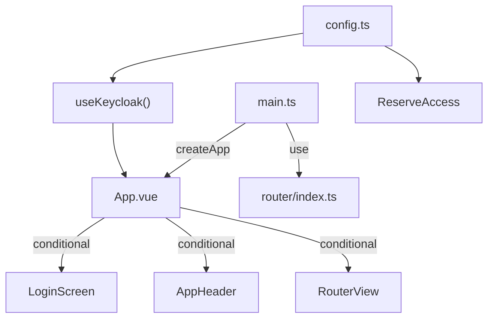

# C4 Code Level: Front-End Entry Point & Configuration

## Overview

- **Name**: Comptoir des Voyageurs — App Bootstrap
- **Description**: Vue 3 application entry point, root component, configuration, and build/serve setup
- **Location**: `packages/front/src/` (root files) + `packages/front/`
- **Language**: TypeScript, Vue 3
- **Purpose**: Bootstrap the SPA, configure Keycloak connection, define build pipeline and nginx serving

## Code Elements

### Entry Point (`main.ts`)
- **Location**: `packages/front/src/main.ts:1-8`
- Creates Vue app from `App.vue`, registers router plugin, mounts to `#app`

### Root Component (`App.vue`)
- **Location**: `packages/front/src/App.vue:1-33`
- Uses `useKeycloak().authenticated` for conditional rendering:
  - Unauthenticated → `<LoginScreen />`
  - Authenticated → `<AppHeader />` + `<RouterView />`

### Configuration (`config.ts`)
- **Location**: `packages/front/src/config.ts:1-12`
- **Exports**:
  - `KEYCLOAK_URL = "http://localhost:8080"`
  - `KEYCLOAK_REALM = "valdoria"`
  - `KEYCLOAK_CLIENT_ID = "comptoir-des-voyageurs"`
  - `API_URL = "http://localhost:3001"`

### Build Configuration (`vite.config.ts`)
- **Location**: `packages/front/vite.config.ts:1-10`
- Plugin: `@vitejs/plugin-vue`
- Dev server: port 5173, `host: true`

### Nginx Configuration (`nginx.conf`)
- **Location**: `packages/front/nginx.conf:1-27`
- SPA fallback: all routes → `index.html`
- Asset caching: 1-year expiry for versioned files
- Security headers: X-Frame-Options, X-Content-Type-Options, X-XSS-Protection
- Gzip compression

## Dependencies

### External
| Package | Version | Purpose |
|---------|---------|---------|
| `vue` | ^3.5.28 | UI framework |
| `vue-router` | ^5.0.2 | Client-side routing |
| `keycloak-js` | ^26.2.3 | OAuth 2.0 / OIDC adapter |
| `vite` | ^7.3.1 | Build tool |
| `@vitejs/plugin-vue` | ^6.0.4 | Vue SFC compilation |

## Relationships

