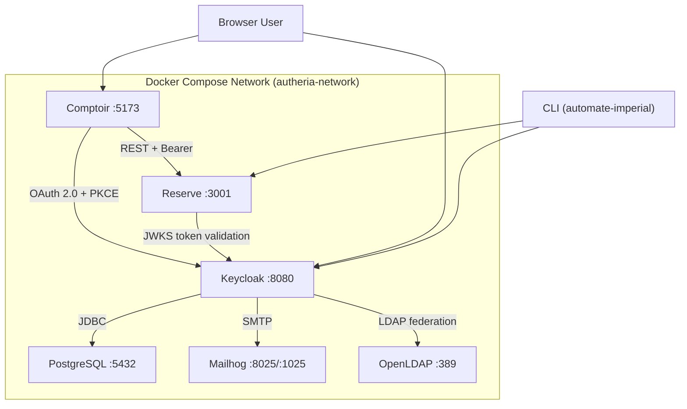

# C4 Code Level: Infrastructure Configuration

## Overview

- **Name**: Keycloak Formation Infrastructure
- **Description**: Complete Docker-based infrastructure for the training platform — identity provider, database, mail server, LDAP directory, and application services
- **Location**: `infrastructure/`
- **Language**: YAML, JSON, LDIF
- **Purpose**: Define the containerized environment for the "Empire d'Authéria" training scenario

## Code Elements

### Docker Compose Services (`docker-compose.yml`)

| Service | Image | Ports | Container | Purpose |
|---------|-------|-------|-----------|---------|
| `postgres` | `postgres:16-alpine` | 5432 | `autheria-postgres` | Keycloak database |
| `keycloak` | `quay.io/keycloak/keycloak:26.5` | 8080, 9000 | `autheria-keycloak` | Identity provider (OIDC/OAuth 2.0) |
| `mailhog` | `mailhog/mailhog:latest` | 1025 (SMTP), 8025 (Web) | `autheria-mailhog` | Email testing |
| `openldap` | `osixia/openldap:1.5.0` | 389 | `autheria-openldap` | LDAP federation source |
| `comptoir` | Built from `packages/front` | 5173:80 | `autheria-comptoir` | Frontend SPA |
| `reserve` | Built from `packages/api` | 3001 | `autheria-reserve` | Protected API |

**Network**: `autheria-network` (bridge driver)

### Keycloak Realm: Valdoria (`keycloak/realm-export-valdoria.json`)

**Clients (10)**:
- Public: `comptoir-des-voyageurs` (SPA+PKCE), `account`, `account-console`, `admin-cli`, `security-admin-console`
- Confidential: `reserve-valdoria` (API), `automate-imperial` (M2M), `realm-management`, `broker`, `valdoria-broker`

**Roles**:
- `sujet` — Base citizen role
- `marchand` — Merchant (market access)
- `gouverneur` — Governor/administrator (composite: inherits `marchand`)
- `guilde-marchands` — Merchants guild group

### Keycloak Realm: Ostmark (`keycloak/realm-export-ostmark.json`)
- Secondary realm simulating an external Identity Provider
- Used for Identity Broker exercise (exercice-10)

### OpenLDAP Bootstrap (`openldap/50-bootstrap.ldif`)

```
dc=registre,dc=valdoria,dc=local
├── ou=people/
│   ├── elara (Estheim) — no group
│   ├── thorin (Nordheim) — guilde-marchands
│   └── aldric (Valdoria-Centre) — gouverneur
└── ou=groups/
    ├── guilde-marchands
    └── gouverneur
```

### Environment Template (`.env.example`)
- `POSTGRES_PASSWORD`, `KC_DB_PASSWORD` — Database credentials
- `KC_BOOTSTRAP_ADMIN_USERNAME/PASSWORD` — Keycloak admin
- `LDAP_ADMIN_PASSWORD`, `LDAP_CONFIG_PASSWORD` — LDAP credentials

## Dependencies

### Service Dependencies
- `keycloak` → `postgres` (JDBC, `depends_on: healthy`)
- `comptoir` → `keycloak` (OAuth 2.0 at runtime)
- `reserve` → `keycloak` (JWT validation at runtime)
- `keycloak` → `openldap` (User federation, configured in realm)
- `keycloak` → `mailhog` (SMTP for email verification)

### External Images
- `postgres:16-alpine`, `quay.io/keycloak/keycloak:26.5`, `mailhog/mailhog:latest`, `osixia/openldap:1.5.0`

## Relationships


