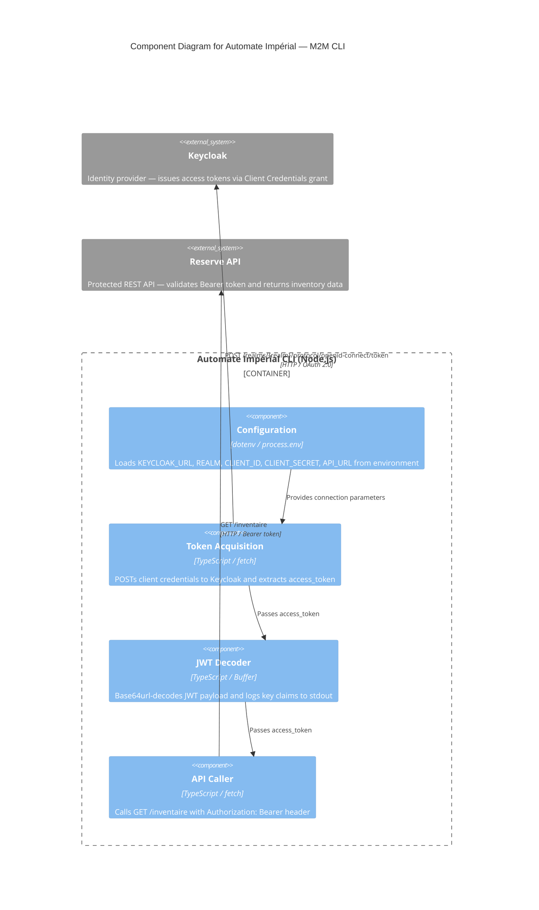

# C4 Component Level: Automate Impérial — M2M CLI

## Overview

- **Name**: Automate Impérial — M2M CLI
- **Description**: Command-line script demonstrating OAuth 2.0 Client Credentials flow for machine-to-machine authentication against Keycloak, with JWT decoding and authenticated API access
- **Type**: CLI Script
- **Technology**: TypeScript, Node.js, dotenv

## Purpose

The Automate Impérial CLI demonstrates the Client Credentials OAuth 2.0 grant type, which is the standard flow for server-to-server (machine-to-machine) authentication where no human user is involved. It walks through the full M2M authentication lifecycle: obtaining an access token from Keycloak using client credentials, inspecting the JWT payload to understand its claims, and consuming a protected API endpoint by presenting the token as a Bearer credential. The component is designed for educational purposes within the formation and intentionally omits JWT signature verification to keep the focus on flow comprehension.

## Software Features

- **Token acquisition (Client Credentials)**: Posts `grant_type=client_credentials` along with `client_id` and `client_secret` to the Keycloak token endpoint, then extracts the `access_token` from the response. Exits with code 1 on failure so integration scripts can detect errors.
- **JWT payload decoding**: Splits the JWT on `.`, base64url-decodes the middle segment, and logs key claims: `sub`, `azp`, realm roles, and token expiration. No signature verification is performed (educational scope only).
- **Authenticated API call**: Sends a GET request to `/inventaire` on the Reserve API, attaching the obtained token as an `Authorization: Bearer` header, then logs the HTTP status code and JSON response body.
- **Environment-based configuration**: All connection parameters (Keycloak URL, realm, client credentials, API URL) are loaded from environment variables via dotenv, making the script portable across environments.

## Code Elements

This component contains the following code-level elements:

- [c4-code-cli-src.md](./c4-code-cli-src.md) — Full code-level documentation for `packages/cli/src/index.ts`, covering configuration constants, the three execution phases, and internal relationships

## Interfaces

### CLI Standard Output

- **Protocol**: stdout (terminal)
- **Description**: Prints structured diagnostic output at each phase — token acquisition result, decoded JWT claims, and API response
- **Operations**:
  - Phase 1 output: success confirmation or error message with exit code 1
  - Phase 2 output: `sub`, `azp`, realm roles, expiration timestamp
  - Phase 3 output: HTTP status code and JSON body from `/inventaire`

### Keycloak Token Endpoint

- **Protocol**: HTTPS / OAuth 2.0 (application/x-www-form-urlencoded)
- **Description**: Requests an access token using the Client Credentials grant
- **Operations**:
  - `POST /realms/{realm}/protocol/openid-connect/token` — Returns `{ access_token, ... }` on success

### Reserve API

- **Protocol**: HTTPS / REST (JSON)
- **Description**: Consumes the protected inventory endpoint using the obtained Bearer token
- **Operations**:
  - `GET /inventaire` — Returns inventory JSON; requires valid `Authorization: Bearer` header

## Dependencies

### Components Used

- None — this is a standalone script with no dependency on other application components

### External Systems

- **Keycloak**: Provides the token endpoint for the Client Credentials grant; must have the `automate-imperial` confidential client configured in the target realm
- **Reserve API**: Exposes `GET /inventaire`; validates Bearer tokens against Keycloak JWKS before responding

## Component Diagram

