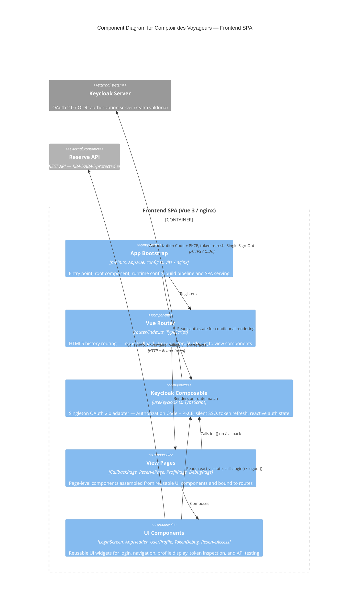

# C4 Component Level: Comptoir des Voyageurs — Frontend SPA

## Overview

- **Name**: Comptoir des Voyageurs — Frontend SPA
- **Description**: Single-Page Application providing OAuth 2.0 authentication, user profile display, JWT token inspection, and RBAC/ABAC API testing for the Keycloak formation exercises
- **Type**: Web Application / SPA
- **Technology**: Vue 3, Vite, keycloak-js, TypeScript, nginx

## Purpose

The Frontend SPA is the primary user-facing container of the "Comptoir des Voyageurs" system. It runs entirely in the browser and delegates all authentication and authorization to a Keycloak server using the OAuth 2.0 Authorization Code flow with PKCE.

Its role in the system is threefold:

1. **Demonstrate authentication flows**: the SPA bootstraps with a silent SSO check, presents a login screen to unauthenticated users, and handles the OAuth 2.0 callback after redirection from Keycloak.
2. **Expose token internals**: a dedicated debug page lets participants inspect all three JWT tokens (access, ID, refresh) including their raw payload and parsed claims — a key learning tool for the formation.
3. **Test authorization policies**: the reserve page calls three endpoints on the Reserve API (RBAC and ABAC) with the bearer token and displays the HTTP response, allowing participants to observe how roles and attributes control access.

## Software Features

- **OAuth 2.0 login (Authorization Code + PKCE)**: initiates the authorization flow via keycloak-js, redirects to Keycloak, and processes the callback to establish a session.
- **Silent SSO check**: on startup, uses `check-sso` strategy to silently detect an existing Keycloak session without forcing a redirect.
- **Automatic token refresh**: a 30-second interval calls `keycloak.updateToken()` to keep the access token valid as long as the browser tab remains open.
- **User profile display**: extracts `preferred_username`, `email`, `given_name`, `family_name`, realm roles, and custom Keycloak attributes from the parsed access token and displays them on the Profil page.
- **JWT token inspection**: renders the raw base64url payload and the decoded JSON of the access token, ID token, and refresh token with collapsible sections.
- **API endpoint testing (RBAC/ABAC)**: calls `/info`, `/inventaire`, and `/villes/:ville/artefacts` on the Reserve API with `Authorization: Bearer <token>` and shows the HTTP status and response body.
- **Single Sign-Out**: triggers Keycloak server-side session invalidation and clears all local reactive state on logout.
- **SPA routing with nginx fallback**: HTML5 history routing served by nginx, which rewrites all paths to `index.html` so deep links and page refreshes work correctly.

## Code Elements

This component contains the following code-level elements:

- [c4-code-front-src.md](./c4-code-front-src.md) — Application entry point (`main.ts`), root component (`App.vue`), runtime configuration (`config.ts`), Vite build setup (`vite.config.ts`), and nginx serving configuration (`nginx.conf`)
- [c4-code-front-src-composables.md](./c4-code-front-src-composables.md) — `useKeycloak()` composable: singleton Keycloak instance, reactive authentication state, JWT parsing, token refresh loop, `init()`, `login()`, and `logout()` functions
- [c4-code-front-src-components.md](./c4-code-front-src-components.md) — Reusable UI components: `LoginScreen.vue`, `AppHeader.vue`, `UserProfile.vue`, `TokenDebug.vue`, `ReserveAccess.vue`
- [c4-code-front-src-views.md](./c4-code-front-src-views.md) — Page-level view components: `CallbackPage.vue`, `ReservePage.vue`, `ProfilPage.vue`, `DebugPage.vue`
- [c4-code-front-src-router.md](./c4-code-front-src-router.md) — Vue Router configuration: route table (`/`, `/callback`, `/reserve`, `/profil`, `/debug`) using HTML5 history mode

## Interfaces

### Browser-Based UI

- **Protocol**: HTTP/HTTPS served by nginx (static files + SPA fallback)
- **Description**: The SPA is delivered as a static bundle to any web browser. All user interaction happens client-side after the initial page load.
- **Routes**:
  - `GET /` — redirects to `/reserve`
  - `GET /callback` — OAuth 2.0 redirect URI; calls `useKeycloak().init()` then navigates to `/reserve`
  - `GET /reserve` — API endpoint testing interface (RBAC/ABAC demonstration)
  - `GET /profil` — user identity, roles, and custom attributes display
  - `GET /debug` — JWT token inspection (access token, ID token, refresh token)

## Dependencies

### Components Used

None — this is a self-contained frontend component with no internal component dependencies within the same container boundary.

### External Systems

- **Keycloak Server** (`http://localhost:8080`, realm `valdoria`, client `comptoir-des-voyageurs`): OAuth 2.0 / OIDC authorization server. Used for Authorization Code + PKCE login, silent SSO check, token issuance and refresh, and Single Sign-Out.
- **Reserve API** (`http://localhost:3001`): REST API providing authorization-controlled endpoints. Called with `Authorization: Bearer <access_token>` from the `ReserveAccess` component.

## Component Diagram

