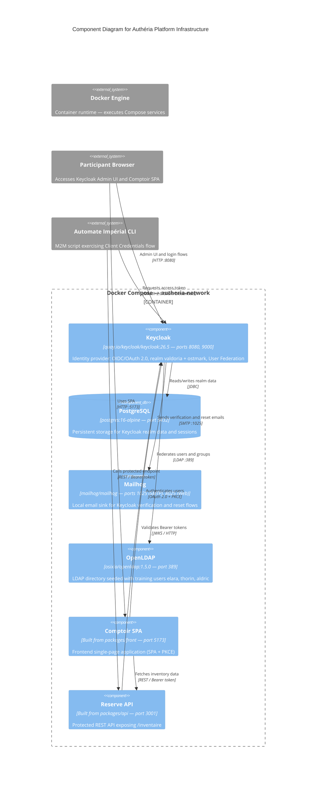

# C4 Component Level: Authéria Platform Infrastructure

## Overview

- **Name**: Authéria Platform Infrastructure
- **Description**: Containerized environment that provisions and orchestrates all services required for the "Empire d'Authéria" training scenario — identity provider, database, mail server, LDAP directory, frontend SPA, and protected API
- **Type**: Infrastructure / Platform
- **Technology**: Docker Compose, PostgreSQL, OpenLDAP, Mailhog

## Purpose

The Authéria Platform Infrastructure defines the complete runtime environment for the Keycloak formation. It composes six services into a shared Docker network, pre-provisions the Keycloak realm with clients, roles, and groups, bootstraps an LDAP directory with training users, and exposes all services on predictable local ports. Participants interact with this infrastructure throughout every exercise without needing to configure services from scratch. The infrastructure also ships a secondary realm (Ostmark) used as an external Identity Provider in the brokering exercise.

## Software Features

- **Service orchestration**: Docker Compose brings up all six services (`postgres`, `keycloak`, `mailhog`, `openldap`, `comptoir`, `reserve`) on a shared bridge network (`autheria-network`) with correct startup ordering enforced by health checks (`keycloak` waits for `postgres: healthy`).
- **Keycloak realm provisioning**: The `realm-export-valdoria.json` file is imported at startup to create the `valdoria` realm with 10 pre-configured clients (public PKCE SPA, confidential API client, M2M client, broker clients), four roles (`sujet`, `marchand`, `gouverneur`, `guilde-marchands`), and the `guilde-marchands` group.
- **External IDP realm (Ostmark)**: A second realm (`realm-export-ostmark.json`) simulates an external Identity Provider for the identity brokering exercise (exercice-10), enabling cross-realm federation scenarios.
- **LDAP user directory**: OpenLDAP is bootstrapped via `50-bootstrap.ldif` with a `dc=registre,dc=valdoria,dc=local` tree containing three training users (`elara`, `thorin`, `aldric`) across two organisational units (`ou=people`, `ou=groups`), ready for Keycloak User Federation configuration.
- **Email testing**: Mailhog provides a local SMTP server (port 1025) and web UI (port 8025) so that Keycloak email verification and password-reset flows can be exercised without a real mail server.
- **Credential management**: An `.env.example` template documents all required secrets (database passwords, Keycloak bootstrap admin, LDAP credentials) so participants can configure their local environment without committing secrets.

## Code Elements

This component contains the following code-level elements:

- [c4-code-infrastructure.md](./c4-code-infrastructure.md) — Full code-level documentation for `infrastructure/`, covering Docker Compose service definitions, realm export files, OpenLDAP bootstrap LDIF, and environment template

## Interfaces

### Docker Compose CLI

- **Protocol**: CLI (shell)
- **Description**: Primary interface for participants to start, stop, and inspect the platform
- **Operations**:
  - `docker compose up -d` — Start all services in detached mode
  - `docker compose down` — Stop and remove containers
  - `docker compose logs <service>` — Inspect service logs

### Exposed Service Ports

- **Protocol**: TCP / HTTP / LDAP / SMTP
- **Description**: Each service binds to a fixed local port, allowing participants and applications to connect predictably

| Service | Port(s) | Protocol |
|---------|---------|----------|
| PostgreSQL | 5432 | TCP / PostgreSQL wire |
| Keycloak HTTP | 8080 | HTTP / OIDC, OAuth 2.0 |
| Keycloak management | 9000 | HTTP |
| Mailhog SMTP | 1025 | SMTP |
| Mailhog Web UI | 8025 | HTTP |
| OpenLDAP | 389 | LDAP |
| Comptoir (SPA) | 5173 | HTTP |
| Reserve (API) | 3001 | HTTP / REST |

## Dependencies

### Components Used

- **Comptoir (Frontend SPA)**: Built from `packages/front` — the Docker Compose file builds the image and binds it to port 5173
- **Reserve (Protected API)**: Built from `packages/api` — the Docker Compose file builds the image and binds it to port 3001

### External Systems

- **Docker Engine**: Required to execute the Compose file; no Docker, no platform
- **postgres:16-alpine** (Docker Hub): PostgreSQL image used as Keycloak's persistence backend
- **quay.io/keycloak/keycloak:26.5** (Quay.io): Official Keycloak image with realm import support
- **mailhog/mailhog:latest** (Docker Hub): Lightweight email testing server
- **osixia/openldap:1.5.0** (Docker Hub): OpenLDAP server with LDIF bootstrap support

## Component Diagram

