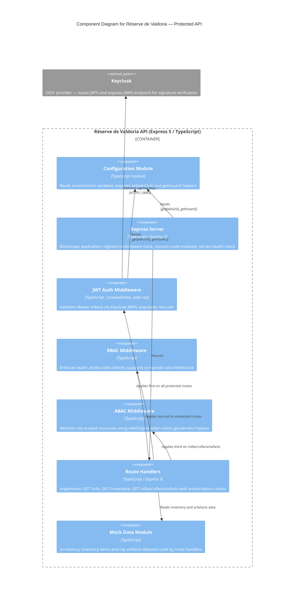

# C4 Component Level: Réserve de Valdoria — Protected API

## Overview

- **Name**: Réserve de Valdoria — Protected API
- **Description**: Protected REST API demonstrating Keycloak-based JWT authentication, role-based access control (RBAC), and attribute-based access control (ABAC) in the context of the Valdoria formation exercises
- **Type**: REST API Service
- **Technology**: TypeScript, Express 5, jsonwebtoken, jwks-rsa

## Purpose

The Réserve de Valdoria API is a fictional protected REST API used as a hands-on learning resource for the Keycloak formation. It exposes three business endpoints (API info, inventory, city artifacts) secured with progressively stricter authorization policies, allowing participants to observe concretely how Keycloak-issued JWTs enforce authentication, RBAC, and ABAC at the API level.

Problems solved by this component:

- Demonstrates end-to-end JWT validation against a live Keycloak realm (JWKS signature verification, issuer and audience validation)
- Illustrates role hierarchy and composite roles (`gouverneur` inheriting `marchand`) through a real API surface
- Shows attribute-based access control using a custom Keycloak token claim (`villeOrigine`) to restrict city-scoped resources
- Provides a minimal, self-contained API that exercises and instructors can run locally alongside Keycloak

## Software Features

- **JWT Authentication**: Validates `Authorization: Bearer <token>` headers by fetching the public signing key from Keycloak's JWKS endpoint (`/realms/{realm}/protocol/openid-connect/certs`). Verifies signature, expiration, audience (`reserve-valdoria`), and issuer (`valdoria` realm). Caches JWKS keys for 10 minutes.
- **Role-Based Access Control (RBAC)**: `requireRole(...roles)` middleware checks `realm_access.roles` in the decoded JWT, supporting composite role inheritance (e.g., `gouverneur` inheriting `marchand`).
- **Attribute-Based Access Control (ABAC)**: `requireVilleAccess` middleware compares the custom `villeOrigine` claim in the JWT against the `:ville` path parameter, restricting users to their city of origin. Users holding the `gouverneur` role bypass this check.
- **Inventory endpoint**: Returns the full list of trade goods in the reserve (`GET /inventaire`), accessible to `marchand` and `gouverneur` roles.
- **City artifacts endpoint**: Returns artifacts for a specific city (`GET /villes/:ville/artefacts`), subject to both RBAC and ABAC. Returns a structured 404 with the list of valid cities when the requested city is unknown.
- **API info endpoint**: Returns API identification metadata (`GET /info`), accessible to any authenticated user holding at least the `sujet` role.
- **Health check**: Unauthenticated `GET /health` endpoint returning `{ status: "ok", timestamp }` for liveness probing.
- **Keycloak configuration management**: Centralised `config` module derives JWKS URI and issuer URL from environment variables, decoupling runtime environment from code.
- **Request logging**: Built-in request logger emitting `[timestamp] METHOD PATH` for each inbound HTTP request.
- **CORS support**: Configured globally for cross-origin browser clients participating in formation exercises.

## Code Elements

This component contains the following code-level documentation files:

- [c4-code-api-src.md](./c4-code-api-src.md) — Express application entry point (`index.ts`), server bootstrap, middleware stack registration, route mounting, health check, global error handlers, and Keycloak configuration module (`config.ts`)
- [c4-code-api-src-middleware.md](./c4-code-api-src-middleware.md) — Security middleware layer: `authenticateJWT` (JWT verification via JWKS), `requireRole` (RBAC), `requireVilleAccess` (ABAC); shared `KeycloakToken` interface
- [c4-code-api-src-routes.md](./c4-code-api-src-routes.md) — Express route handlers: `GET /info` (public), `GET /inventaire` (RBAC), `GET /villes/:ville/artefacts` (RBAC + ABAC); authorization matrix
- [c4-code-api-src-data.md](./c4-code-api-src-data.md) — In-memory mock data module: `InventaireItem` and `Artefact` interfaces, inventory dataset (5 items), artifacts dataset (3 cities × 3 artifacts), city key list

## Interfaces

### Health Check API

- **Protocol**: HTTP GET
- **Description**: Unauthenticated liveness probe, no token required
- **Operations**:
  - `GET /health` — Returns `{ status: "ok", timestamp: string }` (200)

### Public API

- **Protocol**: HTTP GET
- **Description**: General information endpoint for any authenticated user
- **Authentication**: Required — valid Keycloak JWT
- **Authorization**: `sujet` role
- **Operations**:
  - `GET /info` — Returns `{ nom, id, description }` (200); 401 if unauthenticated, 403 if unauthorized

### Inventory API

- **Protocol**: HTTP GET
- **Description**: Returns the full trade goods inventory of the reserve
- **Authentication**: Required — valid Keycloak JWT
- **Authorization**: `marchand` role (or `gouverneur` via composite inheritance)
- **Operations**:
  - `GET /inventaire` — Returns `{ inventaire: InventaireItem[], total: number }` (200); 401, 403

### City Artifacts API

- **Protocol**: HTTP GET
- **Description**: Returns artifacts belonging to a specific city, scoped by both role and origin attribute
- **Authentication**: Required — valid Keycloak JWT
- **Authorization**: `marchand` role (RBAC) + `villeOrigine` claim matching `:ville` (ABAC); `gouverneur` bypasses ABAC
- **Operations**:
  - `GET /villes/:ville/artefacts` — Returns `{ ville, artefacts: Artefact[], total }` (200); `{ error, message, villes_disponibles }` (404); 401, 403

## Dependencies

### Internal Components

- None — this component is self-contained within the `packages/api` package

### External Systems

- **Keycloak** — OIDC provider consulted at runtime for two purposes:
  - JWKS endpoint (`/realms/valdoria/protocol/openid-connect/certs`) to retrieve the public signing key used by `authenticateJWT`
  - Issuer URL (`/realms/valdoria`) validated as the `iss` claim on every incoming JWT

## Component Diagram

