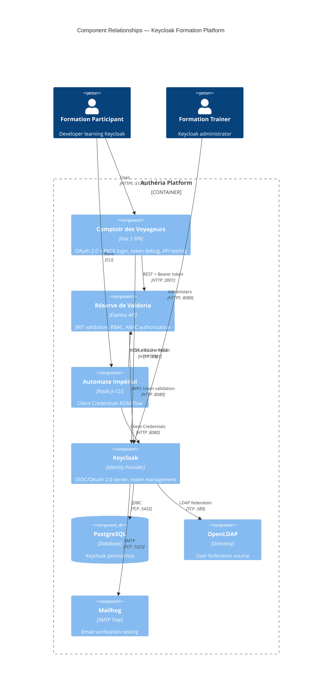

# C4 Component Index — Keycloak Formation Platform

## System Components

| Component | Type | Technology | Description | Documentation |
|-----------|------|------------|-------------|---------------|
| **Réserve de Valdoria — Protected API** | REST API Service | TypeScript, Express 5, jsonwebtoken, jwks-rsa | Protected REST API demonstrating JWT authentication, RBAC, and ABAC authorization patterns with Keycloak | [c4-component-reserve-api.md](c4-component-reserve-api.md) |
| **Comptoir des Voyageurs — Frontend SPA** | Web Application (SPA) | Vue 3, Vite, keycloak-js, TypeScript, nginx | Single-page application implementing OAuth 2.0 Authorization Code + PKCE flow with Keycloak for authentication, token inspection, and protected API access | [c4-component-comptoir-front.md](c4-component-comptoir-front.md) |
| **Automate Impérial — M2M CLI** | CLI Script | TypeScript, Node.js, dotenv | Machine-to-machine script demonstrating OAuth 2.0 Client Credentials flow | [c4-component-automate-cli.md](c4-component-automate-cli.md) |
| **Authéria Platform Infrastructure** | Infrastructure / Platform | Docker Compose, PostgreSQL, Keycloak, OpenLDAP, Mailhog | Containerized environment orchestrating all training services | [c4-component-infrastructure.md](c4-component-infrastructure.md) |

## Component Relationships

## Code-Level Documentation Index

All code-level documentation files that feed into these components:

### Réserve de Valdoria (API)
- [c4-code-api-src.md](c4-code-api-src.md) — Entry point & configuration
- [c4-code-api-src-middleware.md](c4-code-api-src-middleware.md) — Auth, RBAC, ABAC middleware
- [c4-code-api-src-routes.md](c4-code-api-src-routes.md) — Route handlers
- [c4-code-api-src-data.md](c4-code-api-src-data.md) — Mock data layer

### Comptoir des Voyageurs (Frontend)
- [c4-code-front-src.md](c4-code-front-src.md) — App bootstrap & config
- [c4-code-front-src-composables.md](c4-code-front-src-composables.md) — Keycloak composable
- [c4-code-front-src-components.md](c4-code-front-src-components.md) — UI components
- [c4-code-front-src-views.md](c4-code-front-src-views.md) — View pages
- [c4-code-front-src-router.md](c4-code-front-src-router.md) — Router configuration

### Automate Impérial (CLI)
- [c4-code-cli-src.md](c4-code-cli-src.md) — CLI script

### Infrastructure
- [c4-code-infrastructure.md](c4-code-infrastructure.md) — Docker Compose, realms, LDAP
