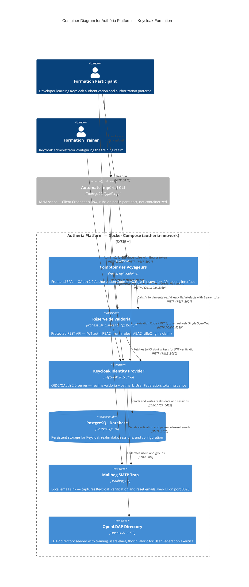

# C4 Container Level: Authéria Platform Deployment

## Containers

### PostgreSQL Database

- **Name**: PostgreSQL Database
- **Description**: Relational database providing persistent storage for all Keycloak realm data, user sessions, clients, and configuration. Keycloak waits for this container to pass its health check before starting.
- **Type**: Database
- **Technology**: PostgreSQL 16 (postgres:16-alpine)
- **Deployment**: Docker container `autheria-postgres`; named volume `postgres_data`; port 5432 exposed on host

---

### Keycloak Identity Provider

- **Name**: Keycloak Identity Provider
- **Description**: OAuth 2.0 / OIDC authorization server pre-loaded with two realms (`valdoria` and `ostmark`). Acts as the central identity authority for all authentication and token issuance in the platform. Exposes the OIDC protocol endpoints, the Admin REST API, and the management health endpoint.
- **Type**: Identity Provider / Web Application
- **Technology**: Keycloak 26.5 (quay.io/keycloak/keycloak:26.5), Java
- **Deployment**: Docker container `autheria-keycloak`; ports 8080 (HTTP / OIDC) and 9000 (management) exposed on host; depends on `postgres: healthy`

---

### Mailhog SMTP Trap

- **Name**: Mailhog SMTP Trap
- **Description**: Local email sink that captures all outbound SMTP traffic from Keycloak without delivering to real recipients. Provides a web UI for inspecting captured messages, enabling participants to exercise email-verification and password-reset flows during the formation.
- **Type**: Mail Server / Web Application
- **Technology**: Mailhog latest (mailhog/mailhog:latest)
- **Deployment**: Docker container `autheria-mailhog`; port 1025 (SMTP) and 8025 (web UI) exposed on host

---

### OpenLDAP Directory

- **Name**: OpenLDAP Directory
- **Description**: LDAP directory server bootstrapped with a `dc=registre,dc=valdoria,dc=local` tree containing three training users (`elara`, `thorin`, `aldric`) in two organisational units. Used as a Keycloak User Federation source in the Day 2 federation exercise.
- **Type**: Directory Service
- **Technology**: OpenLDAP 1.5.0 (osixia/openldap:1.5.0)
- **Deployment**: Docker container `autheria-openldap`; port 389 (LDAP) exposed on host; named volumes `openldap_data` and `openldap_config`

---

### Comptoir des Voyageurs (Frontend SPA)

- **Name**: Comptoir des Voyageurs — Frontend SPA
- **Description**: Single-page application built with Vue 3 and served by nginx. Implements the OAuth 2.0 Authorization Code + PKCE flow via keycloak-js, provides JWT token inspection, user profile display, and interactive testing of the Reserve API RBAC/ABAC endpoints. Built in two Docker stages: Node 20 Alpine for the Vite build, then nginx Alpine for serving.
- **Type**: Web Application (SPA)
- **Technology**: Vue 3, TypeScript, Vite, keycloak-js (build stage: node:20-alpine), nginx:alpine (serve stage)
- **Deployment**: Docker container `autheria-comptoir`; built from `packages/front/Dockerfile`; port 5173 on host mapped to container port 80

---

### Réserve de Valdoria (Protected API)

- **Name**: Réserve de Valdoria — Protected API
- **Description**: REST API exposing inventory and city-artifact endpoints secured with Keycloak-issued JWTs. Enforces JWT authentication (JWKS signature verification), RBAC (realm roles), and ABAC (custom `villeOrigine` claim). Serves as the learning target for authorization exercises throughout the formation.
- **Type**: API Application
- **Technology**: Node.js 20 Alpine, TypeScript, Express 5, jsonwebtoken, jwks-rsa
- **Deployment**: Docker container `autheria-reserve`; built from `packages/api/Dockerfile`; port 3001 exposed on host; depends on `keycloak`

---

### Automate Impérial (M2M CLI)

- **Name**: Automate Impérial — M2M CLI
- **Description**: Command-line script run directly on the participant's host machine (not containerized). Demonstrates the OAuth 2.0 Client Credentials grant: it acquires a token from Keycloak using a confidential client, decodes the JWT payload, and calls the Reserve API with the obtained Bearer token.
- **Type**: CLI Script
- **Technology**: Node.js 20, TypeScript, dotenv
- **Deployment**: Executed locally via `npx ts-node` or `npm start` inside `packages/cli`; reads configuration from environment variables / `.env` file; no Docker container

---

## Purpose

### PostgreSQL Database

Provides durable persistence for Keycloak. All realm configuration (clients, roles, groups, identity providers, user federation), user accounts, and session data are stored here. The database is internal-only: no application other than Keycloak connects to it directly.

### Keycloak Identity Provider

The central identity hub of the platform. It issues JWT access tokens, ID tokens, and refresh tokens under the `valdoria` realm for all application clients (`comptoir-des-voyageurs`, `reserve-valdoria`, `automate-imperial`). It federates users from OpenLDAP, sends email through Mailhog, and hosts a second realm (`ostmark`) used as an external IdP in the brokering exercise. Participants interact with it both through the Admin UI (exercice configuration) and indirectly through application flows.

### Mailhog SMTP Trap

Provides a safe, isolated email environment. Keycloak is configured to route outbound mail to Mailhog on port 1025. Participants can see email-verification and password-reset messages in the Mailhog web UI at port 8025 without any real mail server or external account.

### OpenLDAP Directory

Supplies a pre-seeded user directory for the Keycloak User Federation exercise. The training users (`elara`, `thorin`, `aldric`) are defined in the `50-bootstrap.ldif` file and are available for import into Keycloak via the LDAP User Federation configuration. This container is only required for Day 2 exercises.

### Comptoir des Voyageurs (Frontend SPA)

The main user-facing application for participants during the formation. It demonstrates the full browser-based OAuth 2.0 Authorization Code + PKCE lifecycle: silent SSO, login redirect, callback handling, automatic token refresh, and Single Sign-Out. The token inspection pages serve as a learning tool for understanding JWT structure and claims. The Reserve page allows participants to directly observe how roles and attributes affect API access.

### Réserve de Valdoria (Protected API)

The API learning target. Each exercise tier builds on the previous: authentication (JWT validation), then RBAC (`sujet`, `marchand`, `gouverneur` roles), then ABAC (`villeOrigine` claim vs `:ville` parameter). The API validates tokens by fetching the Keycloak JWKS endpoint, then applies middleware chains that participants can study and extend.

### Automate Impérial (M2M CLI)

Illustrates the server-to-server authentication pattern. Because it runs on the host, it is not part of the Docker network and must reach Keycloak and the Reserve API over `localhost` ports. It is the entry point for the Client Credentials exercise and intentionally omits JWT signature verification to focus attention on the grant flow rather than cryptography.

---

## Components

### PostgreSQL Database

No application-level component documentation — this is a third-party image with no custom code.

### Keycloak Identity Provider

No application-level component documentation — this is a third-party image. Realm provisioning artifacts:

- `infrastructure/realm-export-valdoria.json` — `valdoria` realm definition (clients, roles, groups)
- `infrastructure/realm-export-ostmark.json` — `ostmark` realm definition (external IdP simulation)
- Infrastructure component documentation: [c4-component-infrastructure.md](./c4-component-infrastructure.md)

### Mailhog SMTP Trap

No application-level component documentation — this is a third-party image with no custom code.

### OpenLDAP Directory

No application-level component documentation — this is a third-party image. Bootstrap artifact:

- `infrastructure/ldap/50-bootstrap.ldif` — user and group tree for `dc=registre,dc=valdoria,dc=local`
- Infrastructure component documentation: [c4-component-infrastructure.md](./c4-component-infrastructure.md)

### Comptoir des Voyageurs (Frontend SPA)

This container deploys the following components:

- **Comptoir des Voyageurs — Frontend SPA**: Vue 3 SPA implementing OAuth 2.0 Authorization Code + PKCE, JWT token inspection, and Reserve API testing
  - Documentation: [c4-component-comptoir-front.md](./c4-component-comptoir-front.md)

### Réserve de Valdoria (Protected API)

This container deploys the following components:

- **Réserve de Valdoria — Protected API**: Express 5 REST API with JWT authentication, RBAC, and ABAC middleware
  - Documentation: [c4-component-reserve-api.md](./c4-component-reserve-api.md)

### Automate Impérial (M2M CLI)

This process runs the following component:

- **Automate Impérial — M2M CLI**: Node.js CLI demonstrating OAuth 2.0 Client Credentials flow
  - Documentation: [c4-component-automate-cli.md](./c4-component-automate-cli.md)

---

## Interfaces

### Réserve de Valdoria — REST API

- **Protocol**: HTTP/REST, JSON
- **Description**: Protected business endpoints for inventory and city artifact data, plus an unauthenticated health probe
- **Specification**: [apis/reserve-api.yaml](./apis/reserve-api.yaml)
- **Endpoints**:
  - `GET /health` — Liveness probe; no authentication required; returns `{ status: "ok", timestamp }`
  - `GET /info` — API metadata; requires `sujet` role; returns `{ nom, id, description }`
  - `GET /inventaire` — Full inventory list; requires `marchand` or `gouverneur` role; returns `{ inventaire: [], total }`
  - `GET /villes/:ville/artefacts` — City artifact list; requires `marchand` role (RBAC) and matching `villeOrigine` claim (ABAC); `gouverneur` bypasses ABAC; returns `{ ville, artefacts: [], total }` or 404 with `villes_disponibles`

### Keycloak Identity Provider — OIDC Endpoints

- **Protocol**: HTTPS / OAuth 2.0 / OIDC
- **Description**: Standard OIDC endpoints for authentication flows, token operations, and public key discovery

| Endpoint | Description |
|----------|-------------|
| `GET /realms/valdoria/.well-known/openid-configuration` | OIDC discovery document |
| `GET /realms/valdoria/protocol/openid-connect/auth` | Authorization endpoint (Authorization Code flow) |
| `POST /realms/valdoria/protocol/openid-connect/token` | Token endpoint (Authorization Code exchange, Client Credentials, Refresh) |
| `GET /realms/valdoria/protocol/openid-connect/certs` | JWKS endpoint — public signing keys for JWT verification |
| `GET /realms/valdoria/protocol/openid-connect/userinfo` | UserInfo endpoint — returns claims for authenticated user |
| `GET /realms/valdoria/protocol/openid-connect/logout` | Logout endpoint — server-side session invalidation (Single Sign-Out) |

### Keycloak Identity Provider — Admin REST API

- **Protocol**: HTTP / REST
- **Base URL**: `http://localhost:8080/admin/realms/`
- **Description**: Realm and entity management used by trainers during the formation to create clients, roles, users, and configure federation
- **Authentication**: Bearer token with `admin-cli` client or Admin UI session

### Keycloak Identity Provider — Management Endpoint

- **Protocol**: HTTP
- **Base URL**: `http://localhost:9000`
- **Description**: Internal health and metrics; used by the Docker health check to confirm Keycloak readiness before dependent containers start
- **Endpoints**:
  - `GET /health/ready` — Returns `{ status: "UP" }` when Keycloak is ready

### Mailhog SMTP Trap

- **Protocol**: SMTP (port 1025) / HTTP (port 8025)
- **Description**: SMTP interface receives outbound mail from Keycloak; web UI at port 8025 lets participants read captured messages
- **Web UI URL**: `http://localhost:8025`

### OpenLDAP Directory

- **Protocol**: LDAP (port 389, unencrypted per training configuration)
- **Description**: Keycloak User Federation connects to this endpoint to import and authenticate LDAP users
- **Base DN**: `dc=registre,dc=valdoria,dc=local`

### Comptoir des Voyageurs — Static HTTP

- **Protocol**: HTTP (nginx)
- **Description**: Serves the compiled Vue 3 SPA bundle; all paths fall back to `index.html` for HTML5 history routing; static assets are served with a 1-year cache header
- **URL**: `http://localhost:5173`
- **Routes** (handled client-side by Vue Router):
  - `GET /` — Redirects to `/reserve`
  - `GET /callback` — OAuth 2.0 redirect URI
  - `GET /reserve` — Reserve API testing interface
  - `GET /profil` — User identity and role display
  - `GET /debug` — JWT token inspection

---

## Dependencies

### Inter-Container Communication (within autheria-network)

| From | To | Protocol | Details |
|------|----|----------|---------|
| Keycloak | PostgreSQL | JDBC / TCP | Realm data persistence — `jdbc:postgresql://postgres:5432/keycloak` |
| Keycloak | Mailhog | SMTP | Outbound email — `autheria-mailhog:1025` |
| Keycloak | OpenLDAP | LDAP | User federation — `autheria-openldap:389` |
| Reserve API | Keycloak | HTTP / JWKS | JWKS key fetch for JWT signature verification — `http://keycloak:8080/realms/valdoria/protocol/openid-connect/certs` |

### Client-to-Container Communication (browser / host to containers)

| From | To | Protocol | Details |
|------|----|----------|---------|
| Browser (SPA) | Keycloak | HTTP / OIDC | Authorization Code + PKCE — `http://localhost:8080` |
| Browser (SPA) | Reserve API | HTTP / REST | Bearer token API calls — `http://localhost:3001` |
| Automate CLI | Keycloak | HTTP / OAuth 2.0 | Client Credentials token request — `http://localhost:8080` |
| Automate CLI | Reserve API | HTTP / REST | Bearer token API call — `http://localhost:3001` |
| Trainer browser | Keycloak Admin UI | HTTP | Admin configuration — `http://localhost:8080` |
| Participant browser | Comptoir SPA | HTTP | Application usage — `http://localhost:5173` |
| Participant browser | Mailhog Web UI | HTTP | Email inspection — `http://localhost:8025` |

---

## Infrastructure

### Docker Network

- **Name**: `autheria-network`
- **Driver**: bridge
- **Description**: All six Docker containers share this network. Container-to-container communication uses Docker service names as hostnames (e.g., `keycloak`, `postgres`, `autheria-mailhog`).

### Port Bindings

| Container | Host Port | Container Port | Protocol |
|-----------|-----------|----------------|----------|
| autheria-postgres | 5432 | 5432 | PostgreSQL wire |
| autheria-keycloak | 8080 | 8080 | HTTP / OIDC |
| autheria-keycloak | 9000 | 9000 | HTTP / Management |
| autheria-mailhog | 1025 | 1025 | SMTP |
| autheria-mailhog | 8025 | 8025 | HTTP |
| autheria-openldap | 389 | 389 | LDAP |
| autheria-comptoir | 5173 | 80 | HTTP (nginx) |
| autheria-reserve | 3001 | 3001 | HTTP (Express) |

### Health Checks

| Container | Check | Interval | Retries |
|-----------|-------|----------|---------|
| postgres | `pg_isready -U keycloak -d keycloak` | 10s | 5 |
| keycloak | `GET /health/ready` on port 9000, expects `"status":"UP"` | 15s | 10 (start_period: 30s) |

### Startup Dependencies

- `keycloak` starts only after `postgres` is healthy (`condition: service_healthy`)
- `reserve` starts after `keycloak` (no health condition — depends_on only)

### Volumes

| Volume | Container | Mount |
|--------|-----------|-------|
| `postgres_data` | autheria-postgres | `/var/lib/postgresql/data` |
| `openldap_data` | autheria-openldap | `/var/lib/ldap` |
| `openldap_config` | autheria-openldap | `/etc/ldap/slapd.d` |

### Deployment Configurations

- **Docker Compose**: [infrastructure/docker-compose.yml](../infrastructure/docker-compose.yml)
- **Reserve API Dockerfile**: [packages/api/Dockerfile](../packages/api/Dockerfile) — single-stage, node:20-alpine, TypeScript compile then `npm start`
- **Frontend Dockerfile**: [packages/front/Dockerfile](../packages/front/Dockerfile) — multi-stage: node:20-alpine build (Vite), then nginx:alpine serve
- **nginx configuration**: [packages/front/nginx.conf](../packages/front/nginx.conf) — SPA fallback, 1-year asset cache, security headers, gzip

---

## Container Diagram

