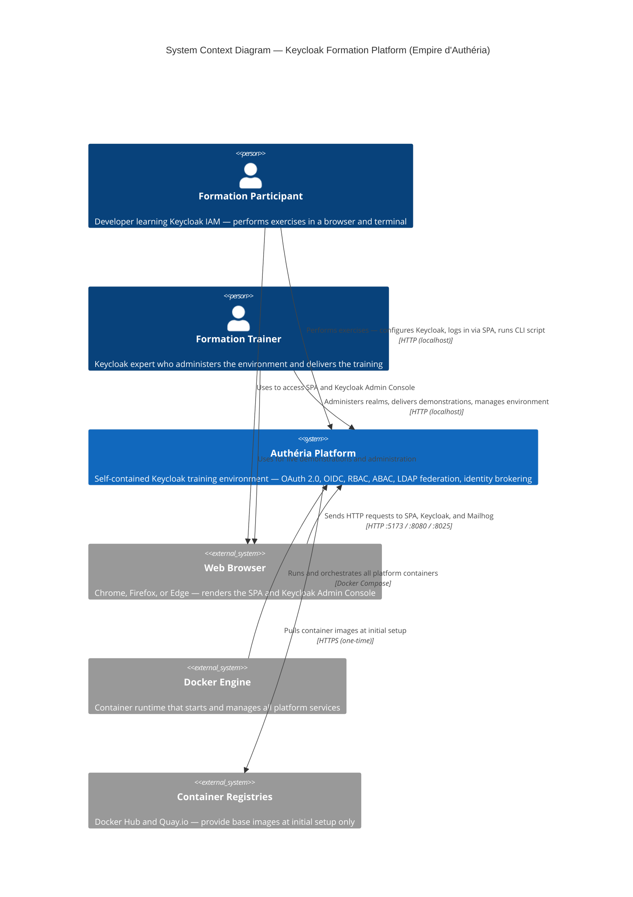

# C4 Context Level: Keycloak Formation Platform — Empire d'Authéria

## System Overview

### Short Description

A self-contained, Docker-based training platform that teaches Keycloak identity and access management through 11 hands-on exercises framed as a fantasy empire narrative.

### Long Description

The Keycloak Formation Platform — "L'Empire d'Authéria" — is a two-day practical training environment designed to teach developers and architects how to implement identity and access management (IAM) using Keycloak 26 with OAuth 2.0 and OpenID Connect.

The platform uses a fantasy empire narrative ("Empire d'Authéria", "Province de Valdoria") as a teaching metaphor: Keycloak realms are "provinces", clients are "comptoirs", roles are "profils métier", and users are "sujets". This narrative makes abstract IAM concepts concrete and memorable.

The system runs entirely on a participant's local machine via Docker Compose, with no external cloud dependencies. It provisions three application components — a Vue 3 SPA ("Comptoir des Voyageurs"), a protected Express API ("Réserve de Valdoria"), and a CLI script ("Automate Impérial") — alongside a full Keycloak identity stack (PostgreSQL, OpenLDAP, Mailhog).

Through 11 progressively complex exercises, participants learn to configure Keycloak realms, manage users and roles, secure browser applications with OAuth 2.0 Authorization Code + PKCE, protect APIs with JWT validation, demonstrate RBAC and ABAC authorization patterns, run machine-to-machine flows via Client Credentials, federate users from an LDAP directory, and broker identities from an external OIDC provider.

The platform solves the key training challenge of providing a realistic, multi-service IAM environment that participants can start in minutes, explore safely, and reset as needed — without depending on shared infrastructure or internet connectivity.

---

## Personas

### Formation Participant

- **Type**: Human User
- **Description**: A developer, architect, or technical practitioner attending the two-day Keycloak training. Has basic Docker knowledge and web development experience. No prior Keycloak experience required.
- **Goals**:
  - Understand how OAuth 2.0 and OpenID Connect work in practice
  - Learn to configure Keycloak realms, clients, roles, and users
  - Observe how JWTs encode identity and authorization claims
  - Implement RBAC and ABAC authorization in a real API
  - Configure LDAP user federation and external identity brokering
- **Key Features Used**:
  - All 11 formation exercises (guided step-by-step)
  - Keycloak Admin Console (realm and user configuration)
  - Comptoir des Voyageurs SPA (OAuth 2.0 login, token inspection, API testing)
  - Automate Impérial CLI (Client Credentials M2M flow)
  - Mailhog Web UI (email verification observation)

### Formation Trainer

- **Type**: Human User
- **Description**: A Keycloak expert or IAM specialist who delivers the training, monitors participant progress, and performs live demonstrations. Has full administrative access to Keycloak.
- **Goals**:
  - Demonstrate Keycloak capabilities in real time
  - Guide participants through exercises and resolve configuration issues
  - Control the shared training environment when running in a group setup
  - Reset or re-provision the environment between training sessions
- **Key Features Used**:
  - Keycloak Admin Console (full administrative access across all realms)
  - Docker Compose CLI (environment lifecycle management)
  - All participant-facing features for demonstration purposes

### Automate Impérial

- **Type**: Programmatic User (M2M Client)
- **Description**: A Node.js CLI script representing a machine-to-machine service account. It has no human user behind it — it authenticates directly to Keycloak using the OAuth 2.0 Client Credentials grant and calls the protected API autonomously. Used in exercice-06 to teach the Client Credentials flow.
- **Goals**:
  - Obtain an access token from Keycloak using client credentials (no user interaction)
  - Decode and display JWT claims for educational observation
  - Call the protected API inventory endpoint (`GET /inventaire`) using the obtained Bearer token
- **Key Features Used**:
  - Machine-to-machine authentication (Client Credentials grant)
  - Token inspection and debugging (CLI stdout)
  - Role-based API access (Réserve de Valdoria `/inventaire`)

---

## System Features

### Realm and Environment Setup

- **Description**: Participants provision a complete Keycloak environment via Docker Compose and configure a dedicated `valdoria` realm from scratch. They explore realm isolation, create roles, configure session lifetimes, and set up SMTP for email delivery. Exercices 01-02.
- **Users**: Formation Participant, Formation Trainer

### User and Role Management

- **Description**: Creation and management of users within the `valdoria` realm. Participants create realm roles (`sujet`, `marchand`, `gouverneur`), configure composite roles that model role hierarchies, assign default roles to all new users, and manage user profiles and credentials. Exercice-03.
- **Users**: Formation Participant, Formation Trainer

### User Authentication (Authorization Code + PKCE)

- **Description**: The Comptoir des Voyageurs SPA authenticates users through the OAuth 2.0 Authorization Code flow with PKCE. The SPA performs a silent SSO check on startup, redirects unauthenticated users to Keycloak login, handles the authorization callback, and maintains a live session with automatic token refresh every 30 seconds. Exercice-04.
- **Users**: Formation Participant

### Token Inspection and Debugging

- **Description**: The Debug page of the Comptoir des Voyageurs SPA renders the raw base64url payload and decoded JSON of the access token, ID token, and refresh token. Participants inspect JWT claims (`sub`, `iss`, `aud`, `realm_access.roles`, `villeOrigine`, `preferred_username`) to understand how Keycloak encodes identity and authorization data. Exercices 04-05.
- **Users**: Formation Participant

### Role-Based Access Control (RBAC)

- **Description**: The Réserve de Valdoria API enforces role-based access through JWT claim inspection. The `/info` endpoint requires the `sujet` role, `/inventaire` requires `marchand`, and `/villes/:ville/artefacts` requires both `marchand` and an ABAC attribute check. The Comptoir SPA's reserve page tests all three endpoints and displays the HTTP response, letting participants observe access granted or denied based on their assigned roles. Exercice-05.
- **Users**: Formation Participant

### Attribute-Based Access Control (ABAC)

- **Description**: The Réserve de Valdoria API restricts the city artifacts endpoint (`GET /villes/:ville/artefacts`) using the `villeOrigine` custom claim from the JWT. Only users whose `villeOrigine` attribute matches the requested city can access that city's artifacts. Users holding the `gouverneur` role bypass this check entirely. Exercice-05 and exercice-08 (custom token mappers).
- **Users**: Formation Participant

### Machine-to-Machine Authentication (Client Credentials)

- **Description**: The Automate Impérial CLI script demonstrates the OAuth 2.0 Client Credentials grant. It requests an access token from Keycloak using a confidential client ID and secret (no user involved), decodes and logs the JWT payload to stdout, then calls `GET /inventaire` with the Bearer token. Participants observe how a service account token differs from a human user token. Exercice-06.
- **Users**: Automate Impérial, Formation Participant (runs the script)

### Group and Guild Management

- **Description**: Participants create Keycloak groups (`guilde-marchands`) and associate realm roles with them. Users added to a group inherit its roles automatically. This models guild membership in the narrative and teaches group-based role assignment as an alternative to direct user-role mapping. Exercice-07.
- **Users**: Formation Participant, Formation Trainer

### Custom Token Claims (Token Mappers)

- **Description**: Participants configure Keycloak client scopes and protocol mappers to inject a custom user attribute (`villeOrigine`) into the JWT access token as a claim. The Comptoir SPA then displays this claim on the Profile page, and the Reserve API uses it for ABAC enforcement. Exercice-08.
- **Users**: Formation Participant, Formation Trainer

### LDAP User Federation

- **Description**: Keycloak is connected to an OpenLDAP directory ("Office du Maître des Registres") via the User Federation feature. LDAP attribute mappers translate LDAP fields (`mail`, `l`) to Keycloak attributes (`email`, `villeOrigine`). A Group Mapper synchronizes LDAP group membership to Keycloak groups, and a Role Mapper converts LDAP group membership directly to realm roles. Three pre-seeded LDAP users (`elara`, `thorin`, `aldric`) are used to verify the federation. Exercice-09.
- **Users**: Formation Participant, Formation Trainer

### Identity Brokering (External OIDC IDP)

- **Description**: Keycloak acts as an identity broker, delegating authentication to a second realm (`Ostmark`) that simulates an external OIDC identity provider. Participants configure an Identity Provider in Valdoria pointing to Ostmark, then configure IDP Mappers to translate foreign roles (`tradesman`) into local roles (`marchand`) and foreign attributes (`city`) into local attributes (`villeOrigine`). An Ostmark user (`ragnar`) can log in to the Comptoir des Voyageurs without having a prior Valdoria account. Exercice-10.
- **Users**: Formation Participant, Formation Trainer

### Email Verification

- **Description**: Keycloak is configured to send verification emails and password-reset notifications through the Mailhog SMTP trap. Participants observe emails arriving in the Mailhog web UI, understanding the full email verification lifecycle within Keycloak's security flows. Exercice-02 (SMTP setup) and exercice-03 (email actions).
- **Users**: Formation Participant, Formation Trainer

---

## User Journeys

### Formation Participant — Environment Setup and First Login (Exercices 01-04)

1. Clone the repository on a local machine with Docker and Node.js installed.
2. Copy `infrastructure/.env.example` to `infrastructure/.env` and run `npm run docker:up` to start all six Docker services.
3. Open `http://localhost:8080` in a web browser to reach the Keycloak Admin Console.
4. Log in to Keycloak as `admin` / `admin` and explore the `master` realm.
5. Create the `valdoria` realm and configure roles (`sujet`, `marchand`, `gouverneur`), session timeouts, and SMTP settings.
6. Create training users and assign roles and custom attributes (`villeOrigine`).
7. Register the `comptoir-des-voyageurs` public OIDC client in the `valdoria` realm.
8. Open `http://localhost:5173` in the browser to reach the Comptoir des Voyageurs SPA.
9. Click "Se connecter" — the SPA redirects to the Keycloak login page.
10. Log in with a training user account; Keycloak issues an authorization code and redirects back to the SPA callback URL.
11. The SPA exchanges the code for access, ID, and refresh tokens and renders the main interface.
12. Navigate to the Profile page to view identity claims and custom attributes from the token.
13. Navigate to the Debug page to inspect the raw and decoded JWT payloads.

### Formation Participant — RBAC and ABAC API Testing (Exercice-05)

1. Log in to the Comptoir des Voyageurs SPA as a user with the `sujet` role only.
2. Navigate to the Reserve page; the SPA calls `GET /info` with the Bearer token — access granted (200).
3. The SPA calls `GET /inventaire` — access denied (403, `marchand` role required).
4. Log out and log back in as a user with the `marchand` role.
5. The Reserve page now shows `GET /inventaire` returning inventory data (200).
6. Call `GET /villes/Estheim/artefacts` as a `marchand` user from Estheim — access granted (200).
7. Call `GET /villes/Nordheim/artefacts` as the same user — access denied (403, ABAC mismatch on `villeOrigine`).
8. Log in as a `gouverneur` user — all endpoints return 200, ABAC check bypassed.

### Formation Participant — Machine-to-Machine Flow (Exercice-06)

1. In the Keycloak Admin Console, create a confidential client `automate-imperial` with Service Accounts enabled.
2. Assign the `marchand` realm role to the service account of `automate-imperial`.
3. Copy the client secret from the Credentials tab.
4. In a terminal, navigate to `packages/cli`, create `.env` from `.env.example`, and paste the client secret.
5. Run `npm start` — the script POSTs `grant_type=client_credentials` to the Keycloak token endpoint.
6. Keycloak returns an access token; the script decodes the JWT payload and prints `sub`, `azp`, realm roles, and expiration to stdout.
7. The script calls `GET /inventaire` on the Reserve API with the Bearer token and prints the HTTP status and JSON response.
8. The participant observes the absence of `email`, `given_name`, and `villeOrigine` in the service account token — confirming this is not a human identity.

### Formation Participant — LDAP User Federation (Exercice-09)

1. Verify the OpenLDAP container is running; inject training users (`elara`, `thorin`, `aldric`) via `ldapadd` if not already seeded.
2. In the Keycloak Admin Console, navigate to User Federation and add an LDAP provider pointing to `ldap://openldap:389`.
3. Configure mappers: `mail` to `email`, `l` to `villeOrigine`, group mapper for `guilde-marchands`, role mapper for `gouverneur`.
4. Trigger a full synchronization — Keycloak imports the three LDAP users.
5. Log in to the Comptoir des Voyageurs SPA as `thorin` (LDAP-federated user with `marchand` role via group).
6. On the Debug page, verify `realm_access.roles` contains `marchand` and `villeOrigine` is `Nordheim`.
7. On the Reserve page, verify `thorin` can access `/inventaire` but only the Nordheim artifacts.

### Formation Participant — Identity Brokering (Exercice-10)

1. Create the `Ostmark` realm in Keycloak and add a test user `ragnar` with the `tradesman` role.
2. Register a confidential client `valdoria-broker` in the Ostmark realm with the Valdoria redirect URI.
3. In the `valdoria` realm, add an OpenID Connect Identity Provider aliased `ostmark` pointing to the Ostmark realm discovery endpoint.
4. Configure an IDP Mapper translating the `tradesman` claim to the local `marchand` role.
5. Open the Comptoir des Voyageurs SPA login page — a "La Confédération d'Ostmark" button now appears.
6. Click the button; the browser redirects to the Ostmark login page.
7. Log in as `ragnar` / `ostmark123` — Keycloak validates the Ostmark token and applies the IDP Mapper.
8. The SPA receives a Valdoria token; the Debug page shows `ragnar` with the `marchand` role despite having no prior Valdoria account.

### Automate Impérial — M2M Authentication Journey

1. The script loads connection parameters from environment variables (`KEYCLOAK_URL`, `REALM`, `CLIENT_ID`, `CLIENT_SECRET`, `API_URL`).
2. The script POSTs to `POST /realms/valdoria/protocol/openid-connect/token` with `grant_type=client_credentials`.
3. Keycloak validates the client credentials against the `automate-imperial` confidential client configuration.
4. Keycloak returns a signed JWT access token encoding the service account's realm roles.
5. The script base64url-decodes the JWT middle segment and logs key claims to stdout.
6. The script sends `GET /inventaire` to the Reserve API with `Authorization: Bearer <token>`.
7. The Reserve API validates the token's signature, issuer, audience, and `marchand` role claim.
8. The Reserve API returns the inventory JSON; the script logs the HTTP status and response body.

---

## External Systems and Dependencies

### Docker Engine

- **Type**: Container Runtime
- **Description**: The host machine's Docker Engine (Docker Desktop or Docker Engine + Docker Compose) is the sole infrastructure dependency required to run the entire platform. All six services run as Docker containers on a shared bridge network (`autheria-network`).
- **Integration Type**: CLI (shell) — `docker compose up -d`, `docker compose down`, `docker compose ps`
- **Purpose**: Provides the isolated runtime environment for all training services. Without Docker Engine, the platform cannot start.

### Web Browser

- **Type**: Client Application (external to the system boundary)
- **Description**: A modern web browser (Chrome, Firefox, Edge) is required on the participant's machine to access the Comptoir des Voyageurs SPA and the Keycloak Admin Console. The browser handles OAuth 2.0 redirect flows, renders the Vue 3 SPA, and displays the Mailhog email inspection UI.
- **Integration Type**: HTTP — participants navigate to `http://localhost:5173` (SPA), `http://localhost:8080` (Keycloak), and `http://localhost:8025` (Mailhog)
- **Purpose**: The primary interface through which human participants interact with the platform.

### Docker Hub (docker.io)

- **Type**: Container Image Registry
- **Description**: Public container image registry from which the PostgreSQL (`postgres:16-alpine`) and Mailhog (`mailhog/mailhog:latest`) images are pulled at first startup.
- **Integration Type**: HTTPS — Docker Engine pulls images automatically on `docker compose up` when images are not cached locally.
- **Purpose**: Provides the base container images for the PostgreSQL and Mailhog services.

### Quay.io

- **Type**: Container Image Registry
- **Description**: Red Hat's public container registry from which the official Keycloak image (`quay.io/keycloak/keycloak:26.5`) is pulled.
- **Integration Type**: HTTPS — Docker Engine pulls the image automatically on first `docker compose up`.
- **Purpose**: Provides the official Keycloak 26.5 container image used as the platform's identity provider.

### OpenLDAP Image Registry (Docker Hub — osixia)

- **Type**: Container Image Registry
- **Description**: Docker Hub source for the OpenLDAP image (`osixia/openldap:1.5.0`) used to run the LDAP directory service.
- **Integration Type**: HTTPS — Docker Engine pulls the image automatically on first `docker compose up`.
- **Purpose**: Provides the LDAP server that simulates an enterprise user directory for the LDAP federation exercise.

> **Note**: All image registries are accessed only at initial setup (image pull). Once images are cached locally, the platform operates fully offline. There are no runtime calls to external cloud services, APIs, or SaaS platforms.

---

## System Context Diagram

---

## Related Documentation

- [Component Index](./c4-component.md) — Full index of all system components with cross-references
- [Comptoir des Voyageurs — Frontend SPA](./c4-component-comptoir-front.md) — Vue 3 SPA component documentation
- [Réserve de Valdoria — Protected API](./c4-component-reserve-api.md) — Express API component documentation
- [Automate Impérial — M2M CLI](./c4-component-automate-cli.md) — CLI script component documentation
- [Authéria Platform Infrastructure](./c4-component-infrastructure.md) — Docker Compose and service infrastructure documentation
